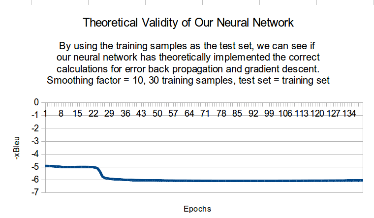
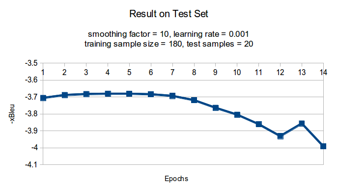

# Description

Deep learning and neural networks in particular have in recent years drastically improved the state-of-the-art in numerous fields including: visual object recognition, object detection, speech recognition, drug discoveries, genomics etc. One domain in which it has not yet become an integral part of, but that is actively being researched on is machine translation of natural languages. 

Gao et. al attempt to address this in their paper [Learning Continuous Phrase Representations for Translation Modeling](http://research.microsoft.com/pubs/211749/nn4smt.acl.v9.pdf). In modern statistical machine translation systems, the smallest translation unit is not words, but phrases. These phrases are not rooted in any deep linguistic notion of the concept phrase, instead it is simply defined as a sequence of words. The longer phrases we can successfully translate, the better the system performance usually gets. However, the longer we make the phrases, the less likely it is that we have observed these in the training set, leading to a severe data sparseness problem. 

To address this problem, Gao et. al propose a way of scoring phrase translation pairs based on a notion of their similarity, which is measured by their Continuous-space Phrase Translation Model (CPTM). This is where the neural network comes in. The process starts with creating a bag-of-words representation of the phrase, which is then projected onto lower dimensional space through a multi-layer neural network. The important part of this process is that the phrase translation pair (a phrase in one language and its translation in another language) share the same vocabulary which enables us to use the same neural network for both languages. The reasoning is that this can help us discover latent features that are useful to differentiate between good and bad translations. The final similarity is then determined by measuring the distance between the two output vectors of the source phrase and its translation.

The first layer of the neural network has the same number of nodes as the vocabulary size of both lanugages. The second and the third layer is set to 100 nodes. The initialization of the weights of the first layer to the hidden layer, denoted as `W1`, is done by using a bilingual topic distribution determined by Latent Dirchlet Allocation. The weights between the hidden layer and the third layer, `W2`, is initialized as an identity matrix.

Optimization of the weights is done using stochastic gradient descent (unlike the paper, in which the authors used their own method called L-BFGS). The training should be stopped according to the early stop principle, as suggested in the paper, however we haven't fine tuned the system sufficiently to determine a stop condition as of yet.

# Dependencies

* python 2.7
* [NumPy](http://www.numpy.org/)
* [Gensim](https://radimrehurek.com/gensim/index.html)

# How to run

Before the first run, `W1` needs to be initialized, using [Latent Dirchlet Allocation](http://en.wikipedia.org/wiki/Latent_Dirichlet_allocation).

	python preprocessing.py $corpus_source $corpus_target $n_best_list $reference_file

where `$corpus_source` and `$corpus_target` are paths to the parallell corpuses the bilingual topic modelling should be based on (every row is a sentence, and each row in `$corpus_source` should have its corresponding translation in the same row of `$corpus_target`), `$n_best_list` is a path to a list of the 100 best translations of source sentences (as outputted by the [Moses system](http://www.statmt.org/?n=Advanced.Search#ntoc1)) and `$reference_file` is a path to the reference translation of those source sentences. Sentence-level BLEU score is also computed during this stage. The W1 initialization and BLEU score are then stored in `./data/weight_initialization.gz` and `sbleu.txt`

After the preprocessing, the system can be trained with

	python main.py $source_sentence_file $n_best_list

where `$source_sentence_file` is a path to the source sentences and `$n_best_list` is a path to the n best translation of these sentences.

#Output

When the system converges, the weights of the neural network are written to the files `W1.gz` and `W2.gz`.

# Experiment results and discussion

After multiple overnight test runs of the system that resulted in calculations that outputted `NaN` due to calculations that accumulated into too large or small numbers, and other issues such as too big gradients resulting in a very unstable gradient descent, we finally managed to get a relatively stable system. The two main parameters that required tuning were: `learning_rate` and `smoothing_factor`, which can be altered at the top of `main.py`. See Equation 6 in the paper by Gao et. al. 2013 for an explanation of the smoothing factor.

As of now, the most stable system we have produced came when the parameters were set as follows: `smoothing_factor = 10` and `learning_rate = 1000`. With these parameter values, we conducted two overnight test runs. 

Because of the non-standard loss function used by this neural network, the first thing we wanted to do was to test the theoretical validity of our system, i.e. whether or not the implemented calculations of the gradients, as suggested by the paper, actually result in a lowering of the loss function -xBleu. To do this, we used 30 training samples, performed the gradient descent training on the entire training set and then tested the new average -xBleu score for the entire training set. I.e. we used the training set as our test set in order to test the theoretical validity of our neural network. The results (See Figure 1) seem to suggest that the system is indeed performing a correct gradient descent.

The second overnight experiment was conducted on a larger training set with 180 training samples and 20 test samples Again, the result of our experiment suggest that the system works (See Figure 2), however after 14 epochs the gradients became very large and the system calculations outputted `NaN` again. Detailed system output can be found in the `lcprtm/Result` directory and the results discussed in this section can be found in the `lcprtm/results/` directory.

# Conclusion

We believe that our neural network correctly learns how to minimize the loss function -xBleu and is relatively stable. Increasing `smoothing_factor` will result in smaller gradients and slower training. Because we are getting `NaN` values (too big or too small numbers) after certain amounts of epochs with large training sets, we believe that `smoothing_factor` should be increased for a more stable system. By how much can only be determined by trial and error, more experiments need to be conducted in order to tune the parameter `smoothing_factor` in particular, and possibly `learning_rate`. 

As of now, the training will run forever as we have not been able to tune the parameters for a sufficiently stable system in order to determine a good convergence criteria.

# Background

This is my (Kerry Zhang) and Richard Luong's final project for the graduate level course "Machine Learning and Translation (80470054)" taken at Tsinghua University, Institute for Interdisciplinary Information Sciences.
